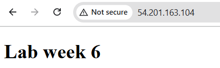

# 4640-w6-lab-start-w25
This project demonstrates using Packer to build an AWS AMI that:
- Runs **Ubuntu 24.04**
- Installs and configures **NGINX**
- Serves a custom HTML page using the included `index.html` and `nginx.conf` files.

---

##  Files

- `web-front.pkr.hcl`
- `files/index.html` 
- `files/nginx.conf` 
- `scripts/install-nginx` 
- `scripts/setup-nginx` 

---

## Screenshot of Deployed Page

This confirms the NGINX server is serving the expected HTML content:



---

## uild Command

```bash
packer build web-front.pkr.hcl
